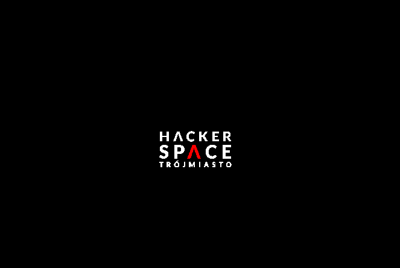
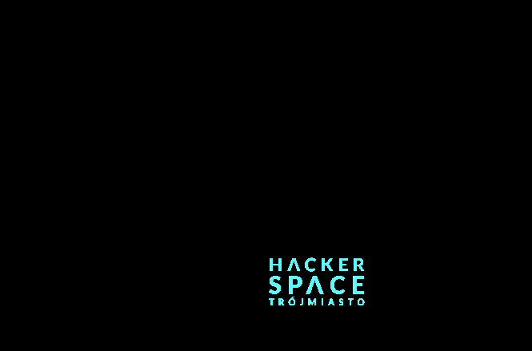
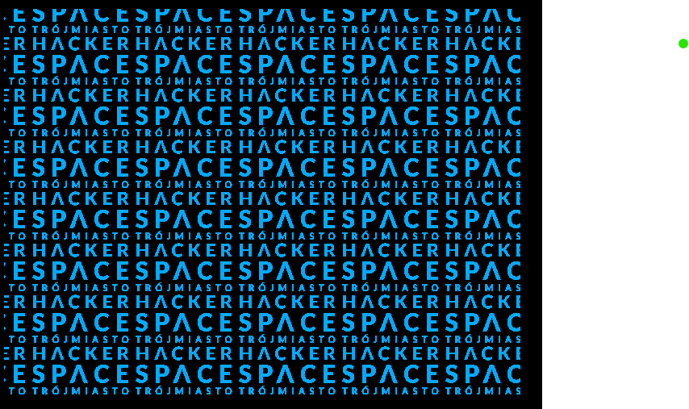
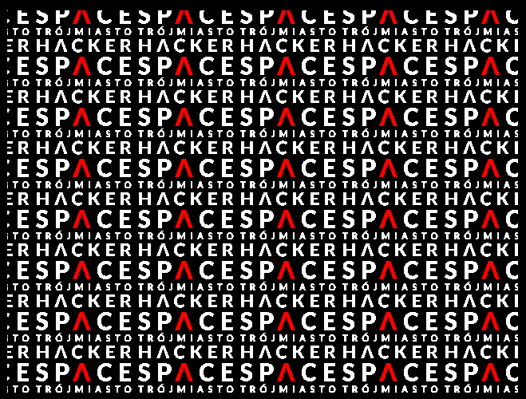

<!---

This file is used to generate your project datasheet. Please fill in the information below and delete any unused
sections.

You can also include images in this folder and reference them in the markdown. Each image must be less than
512 kb in size, and the combined size of all images must be less than 1 MB.
-->

## How it works

This project implements a simple VGA logo display for **Hackerspace Trójmiasto**, generated entirely in hardware using Verilog.

The design includes a VGA timing generator that produces standard 640×480 @ 50 Hz synchronization signals (`hsync`, `vsync`, and active video region). During the active video period, the circuit calculates the current pixel coordinates and uses them to fetch pixel data from an internal bitmap ROM that stores the Hackerspace Trójmiasto logo.

Each logo pixel is encoded using a small number of bits and then mapped to RGB values using either:

*   a **fixed color mapping** (black, white, red), or
*   a **palette-based color mode** where the visible logo color changes dynamically.

The logo can:

*   appear as a single instance that “bounces” around the screen, or
*   be **tiled across the entire display**, depending on configuration.

As the logo moves and hits the screen edges, its color index is automatically updated, creating a simple animated visual effect. All logic runs synchronously from a single clock and is intended to be fully synthesizable and suitable for ASIC implementation (e.g. Tiny Tapeout).

## How to test

### On real hardware

1.  Connect a VGA monitor to the chip using a **PMOD‑to‑VGA converter**.
2.  Power the design and provide the clock input required by the VGA timing generator.
3.  Observe the screen:
    *   The Hackerspace Trójmiasto logo should be visible.
    *   The logo should either move or tile depending on configuration.
4.  Toggle user inputs:
    *   **User input bit 0** enables or disables tiled display mode.
    *   **User input bit 1** switches between fixed RGB colors and palette‑based color mode.
5.  Verify that:
    *   The logo color changes correctly when inputs are toggled.
    *   The display remains stable with proper synchronization (no rolling or tearing).

## External hardware

To use this design with a standard VGA monitor, the following external hardware is required:

*   **PMOD‑to‑VGA converter**  
    This converts the digital RGB and synchronization signals produced by the chip into analog VGA signals compatible with a monitor.

A suitable reference implementation is the PMOD VGA adapter used in the **Tiny Tapeout VGA examples**, which typically includes:

*   Resistor ladder DACs for RGB signals
*   Standard 15‑pin VGA (DE‑15) connector
*   Proper grounding and signal routing for VGA timing stability

[https://github.com/mole99/tiny-vga](https://github.com/mole99/tiny-vga)

Equivalent third‑party PMOD VGA adapter boards may also be used, provided they support:

*   Separate `hsync` and `vsync`
*   At least 1–2 bits per color channel

***
